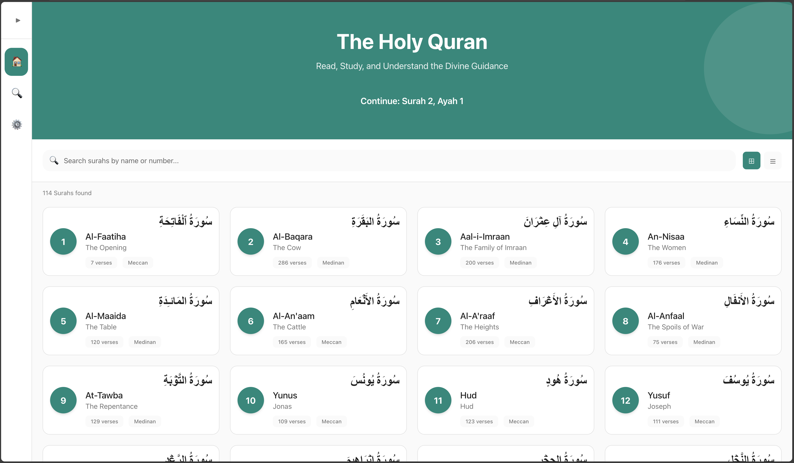

# Nur-e-Hidayah - Quran Web Application

A beautiful, modern web application for reading and studying the Holy Quran with translations, tafseer, audio recitation, and advanced search capabilities.



## Features

- 📖 Complete Quran with Arabic text (all 114 Surahs)
- 🌐 Multiple translations (English, Urdu, Hindi, Arabic)
- 📚 Comprehensive Tafseer including:
  - Ibn Kathir (English, Arabic, Urdu)
  - Sahih International
  - Arabic Taiseer
  - Urdu - Ahmed Ali
  - Hindi Translation
- 🎵 Audio recitation features:
  - Surah-level audio playback
  - Multiple reciters (Alafasy, Abdul Basit, Husary, Minshawi)
  - Progress bar with play/pause controls
  - Verse-by-verse audio
- 🔍 Advanced search functionality across Quran text
- 🌙 Dark mode support
- 🔖 Bookmark management system
- ⚙️ Customizable settings (font size, translations, reciters)
- 💾 Persistent reading position and preferences
- 📱 Responsive design for all screen sizes
- 🚀 Fast performance with optimized loading

## Getting Started

### Prerequisites

- Node.js (v18 or higher)
- npm or yarn

### Installation

1. Clone the repository:
```bash
git clone https://github.com/abdullah1854/nur-e-hidayah.git
cd NurEHidayah
```

2. Install dependencies:
```bash
npm install
```

3. Start the development server:
```bash
npm run web
```

The application will open automatically in your browser at http://localhost:8080

### Building for Production

To create a production build:

```bash
npm run build
```

The optimized files will be in the `dist` directory.

## Technology Stack

- **Frontend**: React Native Web
- **Language**: TypeScript
- **Navigation**: React Navigation
- **Styling**: CSS & StyleSheet
- **State Management**: React Context API
- **HTTP Client**: Axios
- **Build Tool**: Webpack

## API Integration

This application integrates with multiple APIs:

- **Al Quran Cloud API** (https://api.alquran.cloud)
  - Primary source for Quranic text and translations
  - Audio recitation endpoints
  
- **Quran Tafseer API** (https://api.quran-tafseer.com)
  - Secondary source for tafseer data
  
- **Spa5k Tafsir API** (https://quran-tafsir.api.spa5k.com)
  - Additional tafseer resources

## Project Structure

```
NurEHidayah/
├── src/
│   ├── components/
│   │   └── web/
│   │       ├── AudioPlayer.tsx         # Audio playback component
│   │       ├── AudioWithFallback.tsx   # Multi-CDN audio player
│   │       ├── Button.tsx
│   │       ├── Card.tsx
│   │       └── WebLayout.tsx
│   ├── screens/
│   │   └── web/
│   │       ├── WebHomeScreen.tsx       # Surah list screen
│   │       ├── WebReadingScreen.tsx    # Quran reading interface
│   │       ├── WebSearchScreen.tsx     # Search functionality
│   │       ├── WebTafseerScreen.tsx    # Tafseer display
│   │       ├── WebSettingsScreen.tsx   # User preferences
│   │       └── WebLoginScreen.tsx      # Authentication
│   ├── services/
│   │   ├── quranAPI.ts                 # API integration
│   │   ├── authService.ts              # Authentication
│   │   ├── webAudioPlayer.ts           # Audio utilities
│   │   └── webStorage.ts               # Local storage
│   ├── context/
│   │   └── QuranContext.tsx            # Global state
│   └── styles/
│       ├── webStyles.css               # Global styles
│       └── webTheme.ts                 # Theme configuration
├── backend/
│   ├── api/                            # PHP backend endpoints
│   ├── config.php                      # Backend configuration
│   └── database.sql                    # Database schema
├── web/
│   ├── index.html
│   ├── manifest.json
│   └── service-worker.js
├── App.web.tsx                         # Web app entry
├── index.web.js
├── webpack.config.js                   # Webpack configuration
├── DEPLOYMENT.md                       # Deployment guide
├── DEBUG_GUIDE.md                      # Troubleshooting guide
└── package.json
```

## Features in Detail

### Reading Experience
- Beautiful Arabic font (Amiri Quran)
- Smooth scrolling between verses
- Verse highlighting and selection
- Basmala handling (shown for all Surahs except Al-Fatiha and At-Tawbah)

### Audio Features
- Full Surah audio playback
- Multiple reciter options
- Visual progress indication
- Play/pause and restart controls
- Automatic fallback between multiple CDN sources

### Tafseer Integration
- Quick access to tafseer from any verse
- Multiple tafseer sources
- Language-specific tafseer options
- Smooth switching between different commentaries

### Search Capabilities
- Real-time search
- Search in Arabic text or translations
- Highlighted search results
- Direct navigation to search results

### User Preferences
- Font size adjustment
- Translation selection
- Reciter selection
- Dark/light theme toggle
- Persistent settings across sessions

## Troubleshooting

### Common Issues

1. **Audio not playing**
   - Check browser console for CORS errors
   - Verify internet connection
   - Try different reciters
   - See DEBUG_GUIDE.md for detailed troubleshooting

2. **Tafseer not loading**
   - Check API connectivity
   - Verify selected tafseer is available
   - Check browser console for errors

3. **Search not working**
   - Ensure proper API connection
   - Check for rate limiting
   - Verify search query format

### Browser Compatibility

- Chrome: Full support
- Firefox: Full support
- Safari: Full support (may have audio codec limitations)
- Edge: Full support

## Contributing

Contributions are welcome! Please follow these steps:

1. Fork the repository
2. Create a feature branch (`git checkout -b feature/AmazingFeature`)
3. Commit your changes (`git commit -m 'Add some AmazingFeature'`)
4. Push to the branch (`git push origin feature/AmazingFeature`)
5. Open a Pull Request

## License

This project is licensed under the MIT License - see the LICENSE file for details.

## Backend Setup (Optional)

For user authentication and bookmarks persistence:

1. Set up a PHP-enabled web server
2. Import `backend/database.sql`
3. Configure `backend/config.php`
4. Deploy backend files to your server

## Deployment

See [DEPLOYMENT.md](DEPLOYMENT.md) for detailed deployment instructions.

## Acknowledgments

- Al Quran Cloud API for comprehensive Quranic data
- QuranicAudio.com for audio recitation files
- The Muslim community for continuous support and feedback
- All contributors who have helped improve this project

## Contact

For questions, suggestions, or bug reports:
- Create an issue on GitHub
- Email: abdullah@aisavytech.com

---

Made with ❤️ for the Muslim Ummah